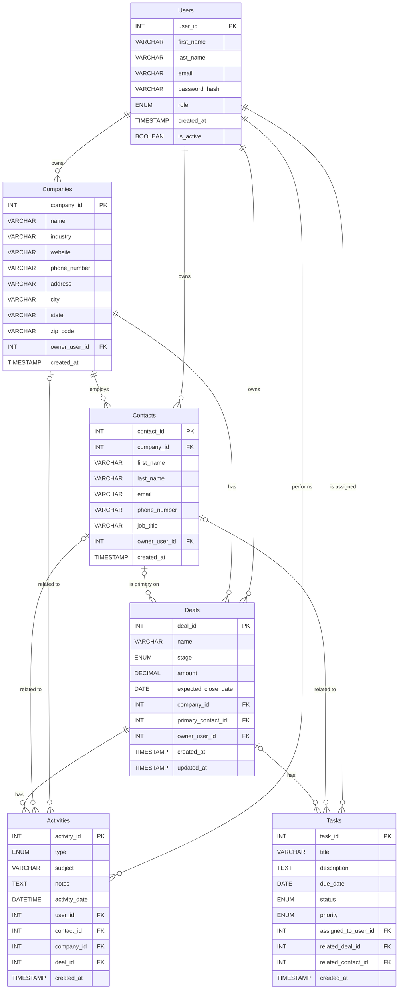

add extension: Markdown Preview Mermaid Support 

For the `working_db.sql`

---

```mermaid
erDiagram
    Users {
        INT user_id PK
        VARCHAR first_name
        VARCHAR last_name
        VARCHAR email
        VARCHAR password_hash
        ENUM role
        TIMESTAMP created_at
        BOOLEAN is_active
    }

    Companies {
        INT company_id PK
        VARCHAR name
        VARCHAR industry
        VARCHAR website
        VARCHAR phone_number
        VARCHAR address
        VARCHAR city
        VARCHAR state
        VARCHAR zip_code
        INT owner_user_id FK
        TIMESTAMP created_at
    }

    Contacts {
        INT contact_id PK
        INT company_id FK
        VARCHAR first_name
        VARCHAR last_name
        VARCHAR email
        VARCHAR phone_number
        VARCHAR job_title
        INT owner_user_id FK
        TIMESTAMP created_at
    }

    Deals {
        INT deal_id PK
        VARCHAR name
        ENUM stage
        DECIMAL amount
        DATE expected_close_date
        INT company_id FK
        INT primary_contact_id FK
        INT owner_user_id FK
        TIMESTAMP created_at
        TIMESTAMP updated_at
    }

    Activities {
        INT activity_id PK
        ENUM type
        VARCHAR subject
        TEXT notes
        DATETIME activity_date
        INT user_id FK
        INT contact_id FK
        INT company_id FK
        INT deal_id FK
        TIMESTAMP created_at
    }

    Tasks {
        INT task_id PK
        VARCHAR title
        TEXT description
        DATE due_date
        ENUM status
        ENUM priority
        INT assigned_to_user_id FK
        INT related_deal_id FK
        INT related_contact_id FK
        TIMESTAMP created_at
    }

    Users ||--o{ Companies : "owns"
    Users ||--o{ Contacts : "owns"
    Users ||--o{ Deals : "owns"
    Users ||--o{ Activities : "performs"
    Users ||--o{ Tasks : "is assigned"
    Companies ||--o{ Contacts : "employs"
    Companies ||--o{ Deals : "has"
    Companies |o--o{ Activities : "related to"
    Contacts |o--o{ Deals : "is primary on"
    Contacts |o--o{ Activities : "related to"
    Contacts |o--o{ Tasks : "related to"
    Deals ||--o{ Activities : "has"
    Deals |o--o{ Tasks : "has"
```